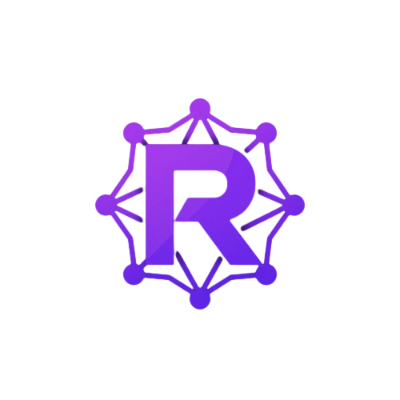

<div align="center">
  
  <h1 align="center" style="font-size: 2.5rem; font-weight: 700; letter-spacing: -0.02em;">Radix</h1>
  <p align="center" style="font-size: 1.1rem; color: #a78bfa;">
    High-Performance Game Server Orchestrator &amp; Daemon Panel
  </p>
  <p align="center">
    
    
    
    
    
    
  </p>
</div>

---

## Overview

**Radix** is a full-stack, multi-engine game server infrastructure orchestrator that lets you dynamically allocate, run, monitor, and manage dedicated game processes across **3 game engines** — Godot, Unity, and Unreal — all from a single, premium web dashboard. Built with **NestJS** on the backend and **Next.js** on the frontend, Radix handles the entire server lifecycle: binary discovery and extraction, engine-specific process spawning, real-time log streaming, and resource telemetry.

---

## Core Features

| Capability | Description |
|---|---|
| **Multi-Engine Orchestration** | Native support for **Godot**, **Unity**, and **Unreal** dedicated servers via a modular engine-adapter plugin system. Upload a ZIP; Radix auto-detects the engine type and applies the correct binary discovery & startup logic. |
| **Dynamic Process Spawning** | Upload game server ZIPs; Radix extracts, discovers binaries (`server.console.exe`, `godot.linuxbsd.server.x86_64`, `.pck` files), and spawns managed child processes with engine-specific arguments. |
| **Full Lifecycle Control** | Start, Stop, Restart, and Force Kill servers on demand. |
| **Real-Time Log Streaming** | WebSocket-driven console output via Socket.IO — tail every `stdout` line in-browser. |
| **Resource Metrics** | CPU, RAM, tick rate, and network I/O tracking loop with live Recharts visualizations. |
| **Role-Based Access** | Granular permission system — Super Admin, Owner, Admin, Moderator, Support, Read Only. |
| **PostgreSQL / SQLite** | TypeORM-backed persistence; uses PostgreSQL in production, auto-falls back to SQLjs (file‑based) in development. |
| **Restful API** | Full CRUD for servers, builds, users, players, bans, backups, and audit logs. |
| **Ultra-Premium UI** | Obsidian/dark violet theme with glassmorphism, neon glow effects, and smooth Framer Motion transitions. |

---

## Architecture

```
                        ┌──────────────────────────────────────┐
                        │           Radix Dashboard            │
                        │         (Next.js / React)            │
                        │              :3000                   │
                        └──────────┬───────────────────────────┘
                                   │ HTTP / WebSocket
                                   ▼
                        ┌──────────────────────────────────────┐
                        │         Radix API Gateway            │
                        │         (NestJS / Express)           │
                        │              :3001                   │
                        └─────┬──────────────┬─────────────────┘
                              │              │
                 ┌────────────▼──┐    ┌──────▼──────────────┐
                 │  PostgreSQL   │    │   Game Servers      │
                 │  / SQLite     │    │  (Child Processes)  │
                 │  (TypeORM)    │    │  stdin/stdout pipes │
                 └───────────────┘    └─────────────────────┘
```

### Server Allocation Flow

1. **Upload** — Admin uploads a `.zip` containing the dedicated server build for any supported engine (Godot, Unity, Unreal).
2. **Engine Detection** — Radix inspects the extracted file tree against engine-specific signatures to determine the correct engine adapter.
3. **Extract** — Backend decompresses the archive using `adm-zip`.
4. **Discover** — The engine adapter recursively scans for known binaries (`server.console.exe` for Godot/Unity, `godot.linuxbsd.server.x86_64`, `.pck` asset packages, Unreal's `GameServer.exe`, etc.).
5. **Persist** — Server metadata (port, region, build version, password, etc.) is written to the database.
6. **Spawn** — On `Start`, Radix forks a child process via Node's `child_process.spawn`, piping `stdout`/`stderr` to the log gateway.
7. **Monitor** — A metrics loop reads CPU/RAM at intervals; updates are pushed to the dashboard via Socket.IO.
8. **Control** — Stop sends `SIGTERM`; Kill sends `SIGKILL`; Restart stops then re-spawns.

---

## Prerequisites

| Tool | Version | Purpose |
|---|---|---|
| [Node.js](https://nodejs.org/) | >= 18.x | Runtime |
| [npm](https://www.npmjs.com/) | >= 9.x | Package manager |
| [PostgreSQL](https://www.postgresql.org/) | >= 14.x | Production database (optional for dev — falls back to SQLjs) |

---

## Setup & Installation

### 1. Clone the Repository

```bash
git clone https://github.com/your-org/radix.git
cd radix
```

### 2. Backend

```bash
cd backend

# Install dependencies
npm install

# Copy environment file and edit as needed
cp .env.example .env

# ── Database ──────────────────────────────────────
# For development, Radix defaults to SQLjs (file-based).
# To use PostgreSQL, set DB_TYPE=postgres in .env
# and ensure PostgreSQL is running.

# ── Seed (optional) ────────────────────────────────
# Creates default roles & an admin user:
npm run seed

# ── Start ──────────────────────────────────────────
# Development (hot-reload):
npm run start:dev

# The API will be available at http://localhost:3001
```

### 3. Frontend

```bash
cd frontend

# Install dependencies
npm install

# Copy environment file
cp .env.example .env.local

# ── Start ──────────────────────────────────────────
npm run dev

# The dashboard will be available at http://localhost:3000
```

### 4. Verify

Open [http://localhost:3000](http://localhost:3000) and log in with the credentials displayed by the seed script (or register a new account).

---

## Environment Variables

### Backend (`backend/.env`)

| Variable | Default | Description |
|---|---|---|
| `NODE_ENV` | `development` | Environment mode |
| `PORT` | `3001` | API server port |
| `DB_TYPE` | `sqljs` | Database type (`postgres` or `sqljs`) |
| `DB_HOST` | `localhost` | PostgreSQL host |
| `DB_PORT` | `5432` | PostgreSQL port |
| `DB_USERNAME` | `postgres` | PostgreSQL user |
| `DB_PASSWORD` | — | PostgreSQL password |
| `DB_DATABASE` | `radix` | PostgreSQL database name |
| `JWT_SECRET` | — | JWT signing secret (64+ chars recommended) |
| `JWT_REFRESH_SECRET` | — | Refresh token secret (64+ chars) |
| `ENCRYPTION_KEY` | — | AES-256 key (exactly 32 chars) |
| `CORS_ORIGIN` | `http://localhost:3000` | Allowed CORS origin |

### Frontend (`frontend/.env.local`)

| Variable | Default | Description |
|---|---|---|
| `NEXT_PUBLIC_API_URL` | `http://localhost:3001` | Backend API base URL |
| `NEXT_PUBLIC_WS_URL` | `http://localhost:3001` | WebSocket server URL |

---

## Scripts

### Backend

```bash
npm run start:dev    # Development with hot-reload
npm run build        # Compile to dist/
npm run start:prod   # Run compiled production build
npm run seed         # Seed database with roles & admin user
npm run lint         # Lint source files
npm run test         # Run tests
```

### Frontend

```bash
npm run dev          # Development with HMR
npm run build        # Production build
npm run start        # Start production build
npm run lint         # Lint source files
npm run typecheck    # TypeScript type checking
```

---

## Tech Stack

**Backend**
- [NestJS](https://nestjs.com/) — Node.js framework
- [TypeORM](https://typeorm.io/) — ORM (PostgreSQL / SQLjs)
- [Socket.IO](https://socket.io/) — Real-time WebSocket gateway
- [Passport](https://www.passportjs.org/) — JWT authentication
- [adm-zip](https://www.npmjs.com/package/adm-zip) — ZIP extraction
- [Swagger](https://swagger.io/) — API documentation (`/api/docs`)

**Frontend**
- [Next.js 14](https://nextjs.org/) — React framework (App Router)
- [Tailwind CSS](https://tailwindcss.com/) — Utility-first styling
- [Radix UI](https://www.radix-ui.com/) — Headless primitives
- [Framer Motion](https://www.framer.com/motion/) — Animations
- [Recharts](https://recharts.org/) — Charts & metrics
- [Zustand](https://zustand-demo.pmnd.rs/) — State management
- [Lucide](https://lucide.dev/) — Icons

---

## Contributing

We welcome contributions! Please see our [Contributing Guide](./.github/CONTRIBUTING.md) for details.

1. Fork the repository
2. Create a feature branch (`git checkout -b feat/amazing-feature`)
3. Commit your changes (`git commit -m 'feat: add amazing feature'`)
4. Push to the branch (`git push origin feat/amazing-feature`)
5. Open a Pull Request

---

## License

Distributed under the Apache License 2.0. See [LICENSE](./LICENSE) for more information.

---

<div align="center">
  <sub>Built with ❤️ by the Radix team.</sub>
</div>
